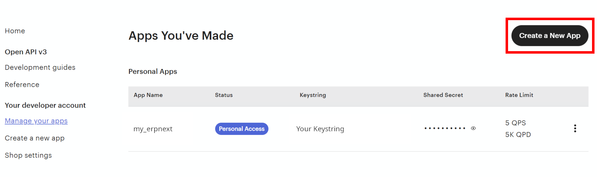
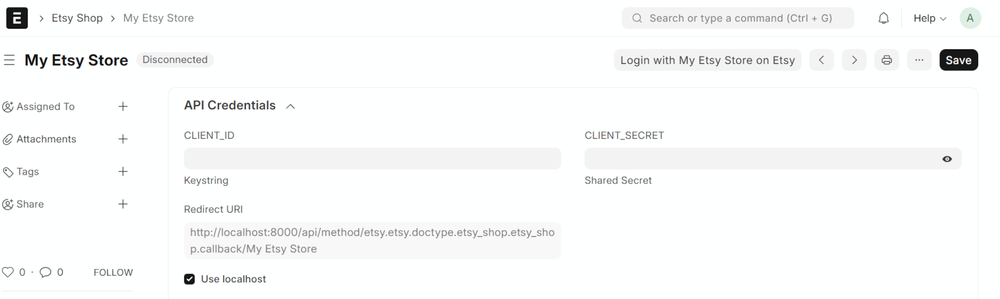
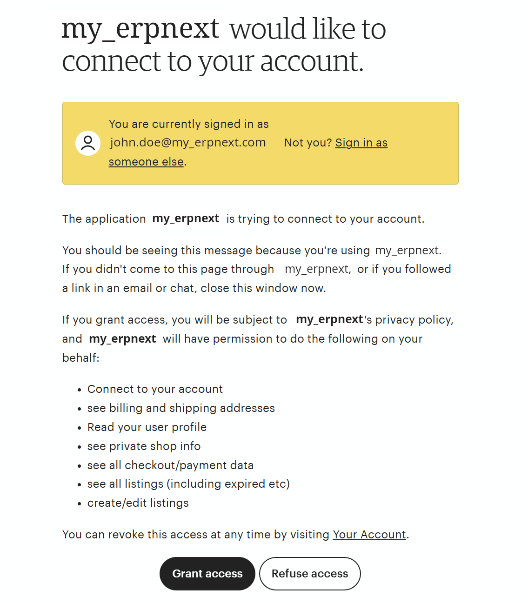

# Getting Started

This guide will walk you through installing and configuring the Etsy Integration app for ERPNext.

## Prerequisites

Before you begin, ensure you have:

- **Frappe Framework** and **ERPNext v15** or higher installed
- **Frappe Bench** CLI tool installed
- **System Manager** role in ERPNext
- An active **Etsy seller account** with at least one shop

## Installation

### Step 1: Install the App

Install the Etsy Integration app using the Frappe Bench CLI:

```bash
# Navigate to your bench directory
cd /path/to/your/bench

# Get the app from GitHub
bench get-app https://github.com/maeurerdev/erpnext-etsy

# Install the app on your site
bench --site your-site-name install-app etsy
```

### Step 2: Verify Installation

After installation, verify that the app is active:

1. Log in to your ERPNext site
2. Go to **Module List** (via search or Home)
3. You should see the **Etsy** module

Alternatively, search for "Etsy Shop" or "Etsy Settings" in the Awesome Bar.

## Setup Your First Etsy Shop

### Step 1: Create Etsy Shop Document

1. In ERPNext, search for **Etsy Shop** in the Awesome Bar
2. Click **New** to create a new Etsy Shop document

3. Enter your **Shop Name** (any descriptive name, e.g., "My Etsy Store")

### Step 2: Configure ERP Settings

Configure how ERPNext should handle Etsy data:

#### Company & Language
- **Company**: Select the ERPNext company for this shop
- **Language**: (Optional) Set language for data formatting

#### Sales Order & Invoice Settings
- **Sales Order Naming Series**: Default is `EtsyOrder-{ETSY_ORDER_ID}`
  - Use `{ETSY_ORDER_ID}` as placeholder
- **Sales Invoice Naming Series**: Default is `EtsyInvoice-{ETSY_ORDER_ID}`
- **Sales Tax Account**: **Required** - Select account for product taxes
- **Shipping Tax Account**: **Required** - Select account for shipping taxes
- **Bank Account for physical sales**: **Required** - Account for physical product payments
- **Bank Account for digital sales**: **Required** - Account for digital product payments

#### Customer Settings
- **Customer Naming Series**: Default is `EtsyUser-{ETSY_BUYER_ID}`
  - Use `{ETSY_BUYER_ID}` as placeholder
  - Example: `Etsy-.YYYY.-{ETSY_BUYER_ID}` for year-based naming
- **Customer Group**: (Optional) Assign a default customer group

#### Item Settings
- **Item Group**: (Optional) Default item group for imported listings
- **Default Unit of Measure**: (Optional) Default UOM for items (can be set per listing)


### Step 3: Save the Document

Click **Save** to save your Etsy Shop configuration.

## Creating an Etsy Personal App

To connect ERPNext with Etsy, you need API credentials from Etsy's Developer Portal.

### Step 1: Access Etsy Developer Portal

1. Go to [Etsy Developer Portal](https://www.etsy.com/developers/your-apps)
2. Sign in with your Etsy seller account
3. Click **Create a New App** or **Get Started**



### Step 2: Create a Personal App

1. **App Name**: Choose a descriptive name (e.g., "my_erpnext")
2. **Is this app for development or production?**: Select based on your needs
3. **What's the URL for your app?**: Enter your ERPNext site URL
4. **Tell us more**: Provide a brief description of how you'll use the API
5. **Terms of Use**: Review and agree to Etsy's API Terms

After submission, Etsy will approve your app (usually instantly for personal apps).


### Step 3: Get Your API Credentials

Once your app is created:

1. Navigate to your app in the [Your Apps](https://www.etsy.com/developers/your-apps) section
2. Note down your **Keystring** (this is your CLIENT_ID)
3. Note down your **Shared Secret** (this is your CLIENT_SECRET)


!!! warning "Keep Credentials Secure"
    Never share your Shared Secret publicly. Store it securely.

### Step 4: Enter API Credentials

In the **API Credentials** section:

1. **CLIENT_ID**: Paste your Etsy Keystring
2. **CLIENT_SECRET**: Paste your Etsy Shared Secret
3. **Use localhost**: Check this only if running ERPNext locally (self-hosted)

The **Redirect URI** field is automatically generated. You'll need this in the next step.



### Step 5: Save the Document

Click **Save** to save your Etsy Shop configuration.

### Step 6: Set Redirect URI on Etsy Developer Portal

1. Copy the **Redirect URI** from your Etsy Shop document
2. Go back to your [Etsy Personal App](https://www.etsy.com/developers/your-apps)
3. Under your app's kebab menu, click **Edit callback URLs**

4. Paste the Redirect URI from ERPNext

5. Save the changes

## Authenticating with Etsy

Now authenticate ERPNext with your Etsy account using OAuth2.

### Step 1: Initiate OAuth Flow

1. In your saved Etsy Shop document, click the **Login** button

2. You'll be redirected to Etsy's authorization page
3. Review the permissions requested

4. Click **Grant Access** to authorize the app

### Step 2: Complete Authentication

After authorization:

1. You'll be redirected back to ERPNext
!!! info "An ERPNext login prompt may show up"
    Log-in with system manager account (Administrator)
2. The Etsy Shop document will automatically update with:
   - **Access Token** and **Refresh Token** (stored securely)
   - **Etsy User ID** and **Shop ID**
   - **Status**: Changed from "Disconnected" to "Connected"
   - **Expires At**: Token expiration datetime


!!! success "Authentication Complete"
    Your Etsy Shop is now connected! The app will automatically refresh tokens before they expire.

## Next Steps

🎉 Congratulations! Your Etsy integration is now set up. Here's what to explore next:

- **[Configuration](configuration.md)** - Learn about advanced configuration options
- **[Features](features.md)** - Explore all features in detail
- **[Synchronization](synchronization.md)** - Understand how sync works
- **[Troubleshooting](troubleshooting.md)** - Common issues and solutions

<!--
TODO: add congratulation - your etsy shop is successfully connected
TODO: finish this document - show some links to the user guide
        1. Setup auto sync (Etsy Settings doctype)
        2. First Data import.
-->

## First Data Import

Let's import your first data from Etsy.

### Import Listings

1. In your Etsy Shop document, click **Import Listings**
2. The app will fetch all active listings from your Etsy shop
3. Check the **Etsy Listing** doctype to see imported listings
4. Items, Item Attributes, and Item Variants will be created automatically


<!-- IMAGE: Screenshot of connected Etsy Shop document showing the action buttons: "Disconnect", "Import Listings", "Import Receipts", and "Import Historic Receipts" in the toolbar -->


<!-- IMAGE: Screenshot of Etsy Listing doctype list view showing multiple listings with columns: Listing ID, Title, Status, Etsy Shop, and thumbnail images -->

### Import Orders

1. In your Etsy Shop document, click **Import Receipts**
2. The app will import recent orders from Etsy
3. For each order, the app creates:
   - **Customer** (if new)
   - **Contact** (with shipping/billing addresses)
   - **Sales Order** (with line items)
   - **Sales Invoice** (if payment is complete)
   - **Payment Entry** (if payment is complete)


<!-- IMAGE: Screenshot of a Sales Order in ERPNext that was created from Etsy showing the custom field "Etsy Order ID" populated, customer info, items, and totals -->

### Import Historical Orders

To import orders from a specific date range:

1. Click **Import Historic Receipts** button
2. Enter a **From Date** (how far back to import)
3. Click **Import**
4. The app will bulk import all orders since that date


<!-- IMAGE: Screenshot of the "Import Historic Receipts" dialog/popup showing a date picker field for "From Date" and "Import" button -->

!!! info "Initial Import Recommendation"
    For your first import, consider importing 30-90 days of historical data to establish a baseline.

## Enabling Automatic Synchronization

Set up scheduled background sync to keep data up-to-date automatically.

### Step 1: Open Etsy Settings

1. Search for **Etsy Settings** in the Awesome Bar
2. This is a singleton doctype (only one instance)


<!-- IMAGE: Screenshot of Etsy Settings document showing "Enable Synchronisation" checkbox unchecked, and two sections: "Sales Order - Synchronisation" and "Item - Synchronisation" with their respective sync interval fields -->

### Step 2: Enable Synchronization

1. Check **Enable Synchronisation**
2. Configure sync intervals:
   - **Sales Order Sync Interval**: In minutes (default: 5, range: 1-60)
   - **Item Sync Interval**: In hours (default: 24, range: 1-24)
3. Click **Save**

The app will automatically create Scheduled Job Types and start syncing in the background.


<!-- IMAGE: Screenshot of Etsy Settings with "Enable Synchronisation" checked, showing sync intervals configured (e.g., 5 minutes for sales orders, 24 hours for items), and the "Last Sync", "Next Sync", and "Scheduler Link" fields now visible and populated -->

### Step 3: Monitor Sync Status

Back in Etsy Settings, you can view:

- **Last Sync**: Timestamp of last successful sync
- **Next Sync**: When the next sync is scheduled
- **Scheduler Link**: Link to the Scheduled Job Type

!!! tip "Disable Sync Temporarily"
    Set sync interval to `0` to disable automatic sync for that data type.

## Quick Reference

### Common Commands

```bash
# Uninstall the app
bench --site your-site-name uninstall-app etsy --no-backup

# Reinstall after updates
bench --site your-site-name migrate

# Run tests
bench --site your-site-name run-tests --app etsy

# Build assets after changes
bench build --app etsy
```

### Etsy Shop Buttons

| Button | Action |
|--------|--------|
| **Login** | Start OAuth2 authentication flow |
| **Disconnect** | Revoke tokens and disconnect shop |
| **Import Listings** | Fetch all active listings |
| **Import Receipts** | Import recent orders |
| **Import Historic Receipts** | Bulk import orders from date |

### Default Naming Series

| DocType | Default Pattern |
|---------|----------------|
| Customer | `EtsyUser-{ETSY_BUYER_ID}` |
| Sales Order | `EtsyOrder-{ETSY_ORDER_ID}` |
| Sales Invoice | `EtsyInvoice-{ETSY_ORDER_ID}` |

!!! note "Customizable Naming"
    All naming series can be customized in the Etsy Shop document.
